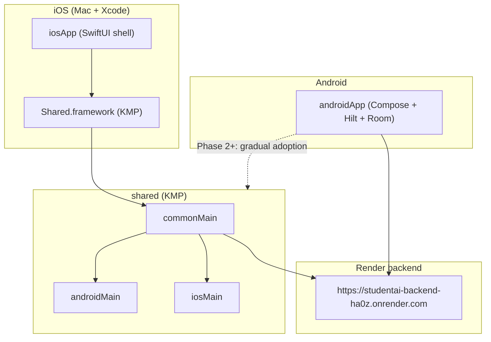

# SchedMate iOS Migration (Kotlin Multiplatform)

> **Status: PAUSED — Android-only first.** Phase 1 KMP scaffolding (`shared/`, `iosApp/`) is in the repo for future use. `:shared` is **not** included in `settings.gradle.kts` during Android-only development so Gradle sync stays fast and Windows-friendly. Re-enable with `include(":shared")` when you have Mac/Xcode access.

Phase 1 establishes a **Kotlin Multiplatform (KMP) + Compose Multiplatform (CMP)** foundation. The Android app (`androidApp`) remains unchanged and production-ready. iOS ships as a thin Xcode shell (`iosApp`) hosting shared Compose UI from the `shared` module.

## Architecture



## Module layout

| Module | Role | Phase 1 status |
|--------|------|----------------|
| `shared/` | Domain models, API DTOs, Ktor client, `ReasoningContentSplitter`, repository **interfaces**, CMP shell UI | **Active** |
| `androidApp/` | Full Android app (Room, Hilt, Firebase, Glance widgets, Retrofit) | **Unchanged** |
| `iosApp/` | Xcode project; embeds `Shared.framework` via Gradle | **Shell + tab UI** |

## What is shared vs platform-specific

### Shared (`shared/src/commonMain`)

- `config/BackendConfig` — backend URL
- `domain/model/` — `UserProfile`, `Flashcard`, `Quiz`, JEVI deck models, enums
- `domain/repository/` — repository interfaces (no Room implementations yet)
- `network/` — Ktor `AiApiClient`, DTOs, JSON parsers
- `ai/ReasoningContentSplitter`
- `StudentAiApp()` — Material 3 tab shell (Home, Schedule, Planner, JEVI, Profile)

### Android-only (`androidApp`)

- Room database, migrations, DAOs
- Hilt dependency injection
- Firebase Auth / Firestore sync
- Glance home-screen widgets
- Camera, WorkManager, DataStore
- Full feature screens and ViewModels

### iOS-only (`iosApp`)

- SwiftUI `ContentView` wrapping `ComposeUIViewController`
- App icons, signing, Info.plist
- Gradle build phase: `:shared:embedAndSignAppleFrameworkForXcode`

## Toolchain versions (Phase 1)

| Component | Version |
|-----------|---------|
| Kotlin | 2.0.21 |
| AGP | 8.7.0 |
| Compose Multiplatform | 1.6.11 |
| Gradle | 8.9 |
| Ktor | 2.3.12 |

KMP targets in `shared`: `androidTarget`, `iosArm64`, `iosSimulatorArm64`, `iosX64`.

## Build on Mac (Xcode)

**Requirements:** macOS, Xcode 16+, Apple Developer team for device builds.

### 1. Clone and open

```bash
cd /path/to/edukasyon
open iosApp/iosApp.xcodeproj
```

### 2. Configure signing

Edit `iosApp/Configuration/Config.xcconfig`:

```
TEAM_ID=YOUR_APPLE_TEAM_ID
PRODUCT_BUNDLE_IDENTIFIER=com.edukasyon.studentai
```

Or set **Development Team** in Xcode target → Signing & Capabilities.

### 3. Build shared framework (CLI, optional)

```bash
./gradlew :shared:embedAndSignAppleFrameworkForXcode
```

Xcode runs this automatically via the **Compile Kotlin Framework** build phase.

### 4. Run

Select an iOS Simulator (or device) and press **Run**. The app shows:

- **Home** — SchedMate branding + live `/health` check against Render backend
- **Other tabs** — placeholders for Phase 2 screens

### 5. Gradle-only iOS compile (no Xcode UI)

```bash
./gradlew :shared:compileKotlinIosSimulatorArm64
./gradlew :shared:iosSimulatorArm64Test
```

## Build Android (Windows / any OS)

Android is **not** wired to `shared` yet (avoids breaking Hilt/Room). Verify as before:

```bash
./gradlew :androidApp:compileDebugKotlin
```

Optional shared module checks on Windows:

```bash
./gradlew :shared:compileDebugKotlinAndroid
./gradlew :shared:cleanAllTests :shared:allTests
```

## Backend

Both platforms use:

```
https://studentai-backend-ha0z.onrender.com/
```

Defined in `shared/.../BackendConfig.kt` (KMP) and `androidApp` `buildConfigField` (Android).

## Roadmap

### Phase 2 — Shared data & Android bridge

- [ ] SQLDelight schema mirroring core Room entities (user, schedule, flashcards)
- [ ] Shared repository implementations (in-memory or SQLDelight)
- [ ] Android: depend on `:shared`, delegate domain models + `AiApiClient` + `ReasoningContentSplitter`
- [ ] iOS: Home dashboard with real schedule/tasks from shared repo

### Phase 3 — Feature screens (CMP)

- [ ] Migrate Schedule, Planner, JEVI, Profile screens to `shared` Compose
- [ ] Shared ViewModels (`kotlinx-coroutines`, no Hilt in commonMain — use Koin or manual DI)
- [ ] Platform auth: Firebase KMP or expect/actual wrappers

### Phase 4 — Parity & polish

- [ ] Push notifications, widgets (WidgetKit), camera/schedule scanner
- [ ] App Store / TestFlight pipeline
- [ ] Remove duplicated Android-only network code once Retrofit → Ktor migration is complete

## Notes for Windows development

- iOS **cannot** be built or run on Windows; the repo structure is validated via `:shared:compileDebugKotlinAndroid` and `:androidApp:compileDebugKotlin`.
- Use a Mac CI runner (e.g. GitHub Actions `macos-latest`) for iOS builds: `./gradlew :shared:embedAndSignAppleFrameworkForXcode`.

## File entry points

| Platform | Entry |
|----------|-------|
| iOS UI | `shared/.../StudentAiApp.kt` → `iosMain/.../MainViewController.kt` |
| iOS shell | `iosApp/iosApp/iOSApp.swift`, `ContentView.swift` |
| Android UI | `androidApp/.../MainActivity.kt` → `StudentAiApp()` (Android-only, unchanged) |
| Shared API | `shared/.../network/AiApiClient.kt` |
